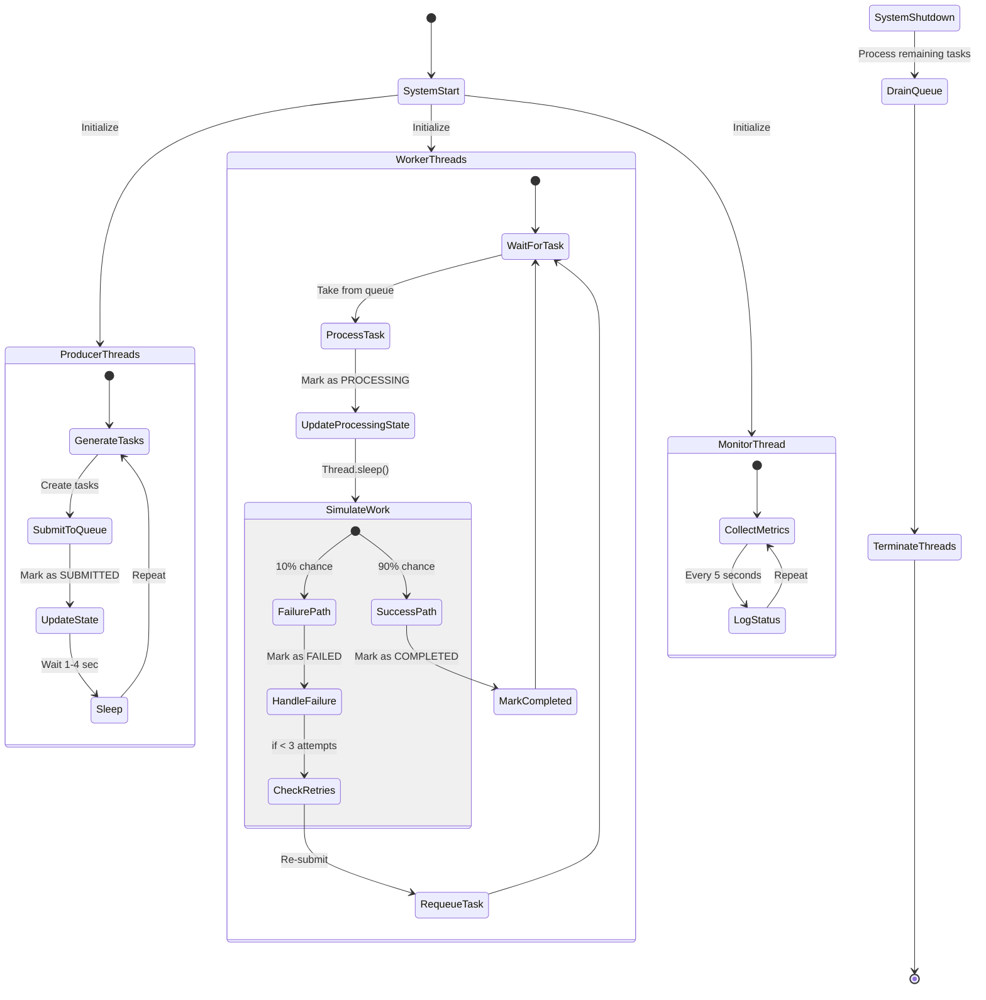

# ConcurQueue - Multithreaded Job Processing Platform

A high-performance job dispatcher system that handles multiple producer clients submitting jobs and distributes them to worker threads for concurrent processing.

## Features
- Priority-based task scheduling
- Thread-safe task queue (PriorityBlockingQueue)
- Task state tracking (SUBMITTED, PROCESSING, COMPLETED, FAILED)
- Automatic retry mechanism (up to 3 times)
- System monitoring thread
- Graceful shutdown handling
- Race condition demonstration and solution

## How to Run
1. Clone the repository:
   ```bash
   git clone https://github.com/thenoblet/concurqueue.git
   cd concurqueue
   ```

2. Compile and run:
   ```bash
   javac src/*.java -d bin/
   java -cp bin/ ConcurQueue
   ```

3. The system will start automatically:
   - 3 producer threads generating tasks
   - 4 worker threads processing tasks
   - 1 monitor thread reporting system status

4. Press Ctrl+C to initiate graceful shutdown

---

## GitHub Repository Structure
```
concurqueue/
├── .idea/
├── .mvn/
├── exports/
├── src/
│   ├── main/
│   │   ├── java/
│   │   │   └── gtp/
│   │   │       ├── config/
│   │   │       │   └── AppConfig.java
│   │   │       ├── core/
│   │   │       │   ├── ConcurQueue.java
│   │   │       │   ├── SystemMonitor.java
│   │   │       │   ├── TaskDispatcher.java
│   │   │       │   └── TaskStateTracker.java
│   │   │       ├── model/
│   │   │       │   ├── Task.java
│   │   │       │   └── TaskStatus.java
│   │   │       ├── producer/
│   │   │       │   └── TaskProducer.java
│   │   │       ├── util/
│   │   │       │   ├── GracefulShutdown.java
│   │   │       │   └── JsonExporter.java
│   │   │       └── worker/
│   │   │           └── TaskWorker.java
│   │   └── resources/
│   │       ├── application.properties
│   │       └── logback.xml
│   └── test/
│       └── java/
```

---

## Design Explanation
The system follows the producer-consumer pattern with these key components:

1. **Task Queue**: PriorityBlockingQueue ensures thread-safe operations and priority-based ordering
2. **Producers**: Generate tasks with random priorities and payloads
3. **Workers**: Process tasks with simulated work and failure scenarios
4. **State Tracker**: ConcurrentHashMap maintains task statuses
5. **Monitor**: Periodically reports system metrics
6. **Shutdown Hook**: Ensures all pending tasks are processed before termination

Synchronization points:
- Task submission (queue.put())
- Task processing (queue.take())
- State updates (ConcurrentHashMap)
- Counter increments (AtomicInteger)

---

## Activity Diagram

### Activity Diagram Description:


Key synchronisation points shown in diagram:
1. Queue access (both producers and workers)
2. State updates (shared ConcurrentHashMap)
3. Counter increments (race condition example)
4. Shutdown sequence coordination

The diagram illustrates:
- Parallel execution of producers and workers
- Task lifecycle from submission to completion
- Error handling and retry logic
- Monitoring and shutdown flows

---

### Race Condition Demonstration
The system includes two counters:
1. `unsafeCounter` - demonstrates race condition
2. `safeCounter` - fixed with AtomicInteger

Monitor thread reports both values - you'll see:
- `unsafeCounter` eventually shows incorrect values
- `safeCounter` always maintains accuracy

### Performance Characteristics
- Throughput: ~50-100 tasks/second (depending on simulated work time)
- Latency: Typically <100ms for high-priority tasks
- Scalability: Adding more workers linearly increases throughput

### Monitoring Output Example
```
=== System Status ===
Queue size: 17
Tasks: 482 submitted, 10 processing, 144 completed, 2 failed

--- Synchronization Demo ---
Counters: unsafe=181,110 | safe=181,181 (lost updates: 71)
Thread pool: java.util.concurrent.ThreadPoolExecutor@9807454[Shutting down, pool size = 10, active threads = 10, queued tasks = 0, completed tasks = 0]
=====================
```
